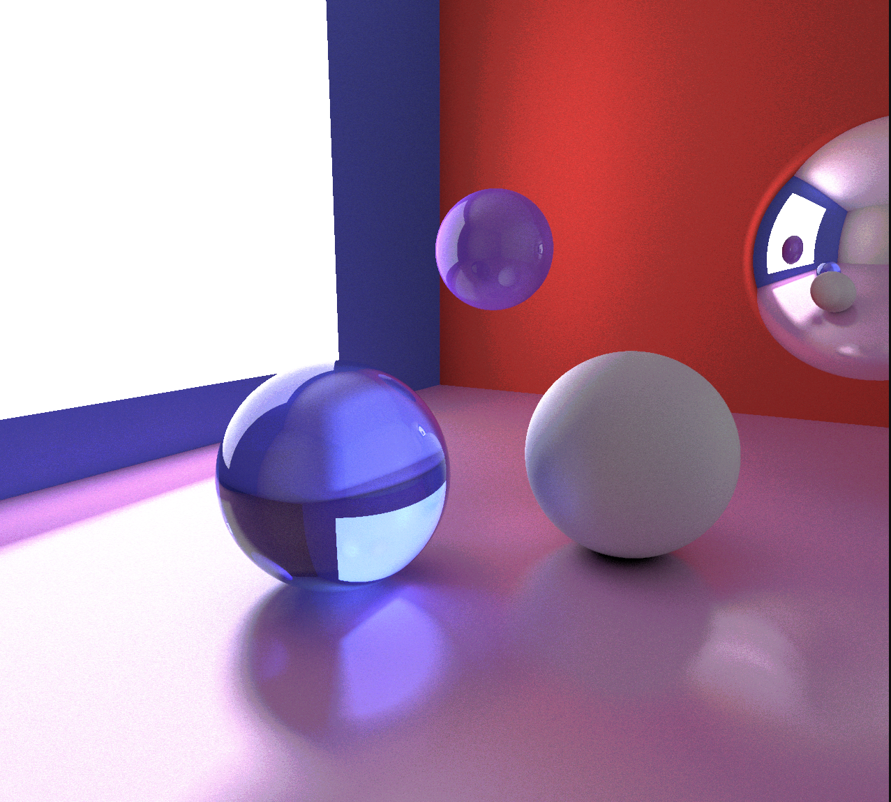
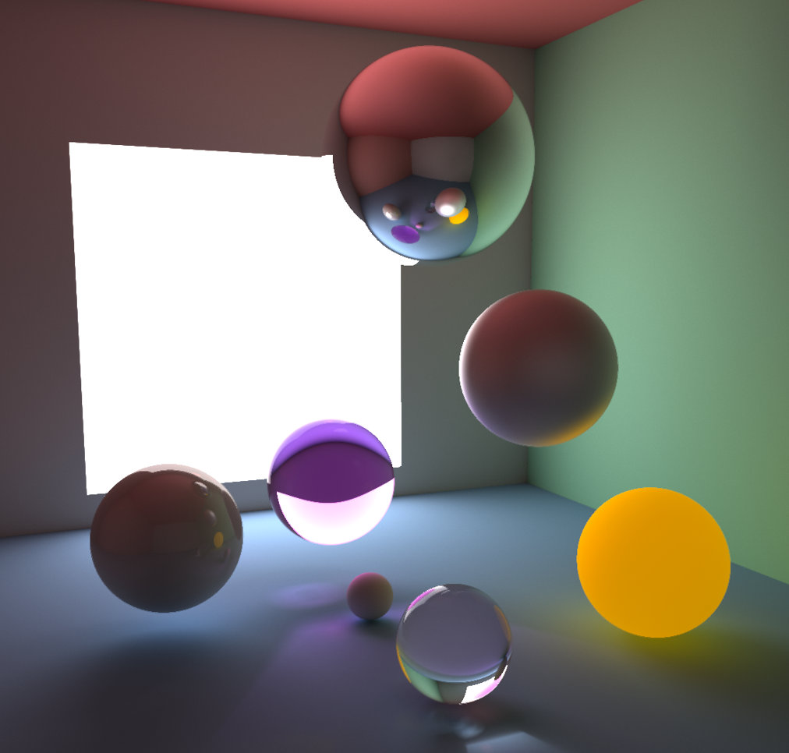

 

# CoconutGraphics
CoconutGraphics is my first OpenGL project: a C++/OpenGL path tracer built to explore physically based rendering, optics, and light transport from first principles.

The renderer supports spheres, planes, and rectangles, with editable material parameters through a Dear ImGui interface. It includes two rendering modes: a fast preview mode for navigating and editing the scene, and a path-traced render mode for accumulated physically based rendering.

This project was inspired by Sebastian Lague's ray tracing videos, which helped me understand some of the mathematical foundations behind ray tracing. I used the project as a way to go deeper into the physics and implementation details myself, including reflection, refraction, Fresnel effects, and material behavior.

## Features
- C++ / OpenGL rendering pipeline
- Path tracing / ray tracing renderer
- Spheres, planes, and rectangles
- Editable materials through Dear ImGui
- Diffuse, metallic, and glass-like materials
- Fresnel reflection using Schlick approximation
- Progressive frame accumulation in render mode
- Fast preview mode for scene navigation and editing
- Basic camera controls and interactive UI
  
# Project Scope
The goal of this project was to build a renderer from scratch and understand how light transport, geometry, probability, and optics come together in physically based rendering.

This project is not meant to be a production renderer. It is a learning-focused graphics project where I implemented the core ideas behind ray tracing and path tracing myself, while experimenting with materials, reflections, refractions, and scene interaction.

## Controls
- Press R to toggle between preview mode and render mode.
- Press C to toggle camera movement.
  
# Status
This project is mostly complete as a learning renderer, although there are still some bugs and areas for improvement.

## Known future improvements include:
- Better scene loading
- More robust camera controls
- More sampling strategies
- Improved denoising / variance reduction
- More material models
- Cleaner UI and scene editing tools
- Compilation Instructions
- Download the project as a ZIP file.
- Extract the ZIP file.
- Open the extracted folder in Visual Studio.
- Configure and build the project using CMake.
- 
# Acknowledgements
This project was heavily inspired by Sebastian Lague's ray tracing videos, which helped introduce me to the core ideas behind ray tracing and physically based rendering.
