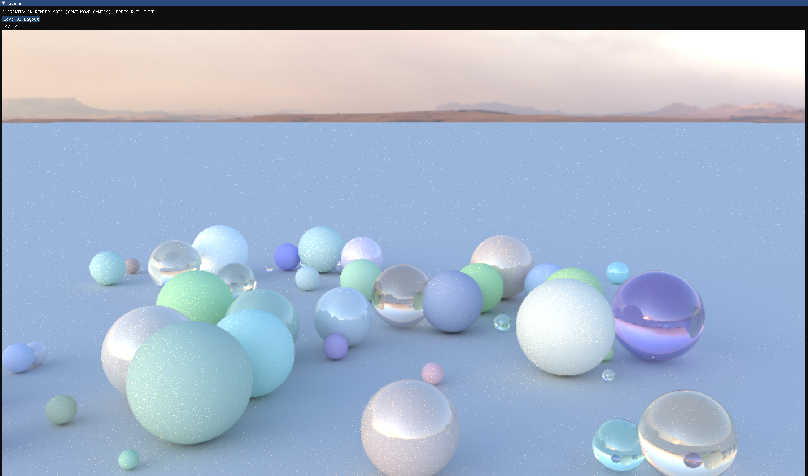

# Introduction
This is my first OpenGL project, for which i decided to make a simple path/ray tracer. For now, supported objects are rectangles, planes and spheres. Various material parameters are available and can be modifed through the UI implemented using Dear ImGui. There are two rendering modes, a preview mode and a "render" mode, this can be toggled by pressing R. Preview mode basically flat shades everything whilst the render mode is where the rendering happens. This project was heavily inspired by Sebastian Lague's ray tracer, his video helped me understand some of the math behind this project.

P.S: there are some bugs, feel free to report any you stumble upon !

# Compilation Instructions
For compilation, download the project zip, extract it and open the extracted folder with visual studio. Finally, compile using the cmakelists.txt files as your target.

# TODO

- Implement antialiasing (Currently doesn't work too well)
- Implement textures for objects
- Add ability to change skybox whilst the program is running
- Optimisations

